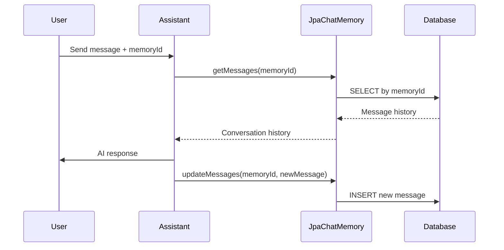

# Integrating LangChain4J with Spring JPA: Building Persistent Story Memory for Your AI Assistant

You know this situation: you tell a chatbot something important, and a moment later it already forgot. It feels a bit like talking to Dory from *Finding Nemo*. Cute maybe, but not so useful.

In this post we make the chatbot less forgetful. We combine **LangChain4J** with **Spring JPA** to give it a **persistent memory**. That means the assistant can remember conversations across messages and even across restarts. Like a diary for your AI.

We will:

* Store messages in a database with JPA
* Fetch them back in the right order
* Attach this memory to any LangChain4J model (Ollama, OpenAI, local etc.)

---

## Why memory is important in conversational AI

By default many LLMs are stateless. They only react to the current input. Imagine this:

> You: "My name is Alice."
> Bot: "Nice to meet you, Alice."
> (a minute later)
> You: "What is my name?"
> Bot: "I don’t know. But I can call you User #12345."

Not really smart.

With memory, the bot remembers that you are Alice, that you like coffee, and that yesterday you asked it to generate a regex (sorry about that). In customer support, personal assistants or any production system, this kind of statefulness is not optional.

---

## Step 1: Define the Entity for chat messages

We need a JPA entity to store messages in the database:

```java
@Entity
public class ChatMessageEntity {

    @Id
    @GeneratedValue(strategy = GenerationType.IDENTITY)
    private Long id;
    private String memoryId;
    @Column(columnDefinition = "TEXT")
    private String content;
    private LocalDateTime createdAt;

    // Getters and setters...
}
```

* `@Entity` makes this a database table
* `@Column(columnDefinition = "TEXT")` makes sure long JSON strings fit
* `createdAt` gives us the order of messages

Think of it like the assistant’s diary. Messages go in here and stay there.

---

## Step 2: Repository for queries

Spring Data JPA makes this trivial:

```java
public interface ChatMessageRepository extends JpaRepository<ChatMessageEntity, String> {
    List<ChatMessageEntity> findByMemoryIdOrderByCreatedAtAsc(String memoryId);
}
```

This will always return the conversation in the correct order. Very little code, very Spring.

---

## Step 3: Define the Assistant interface

```java
public interface AssistantWithMemory {
    TokenStream chat(@MemoryId long memoryId, @UserMessage String userMessage);
}
```

The annotations here tell LangChain4J what is the user input and which memory bucket to use.
This way each user or session can have their own memory.

---

## Step 4: Build the JPA memory store

Now we connect LangChain4J’s memory API with JPA:

```java
@Component
public class JpaChatMemory implements ChatMemoryStore {

    private final ChatMessageRepository repository;

    public JpaChatMemory(ChatMessageRepository repository) {
        this.repository = repository;
    }

    @Override
    public List<ChatMessage> getMessages(Object memoryId) {
        return repository.findByMemoryIdOrderByCreatedAtAsc(memoryId.toString())
                .stream()
                .map(entity -> ChatMessageDeserializer.messageFromJson(entity.getContent()))
                .toList();
    }

    @Override
    public void updateMessages(Object memoryId, List<ChatMessage> messages) {
        messages.forEach(message -> {
            ChatMessageEntity entity = new ChatMessageEntity();
            entity.setMemoryId(memoryId.toString());
            entity.setContent(ChatMessageSerializer.messageToJson(message));
            entity.setCreatedAt(LocalDateTime.now());
            repository.save(entity);
        });
    }

    @Override
    public void deleteMessages(Object memoryId) {
        this.repository.deleteByMemoryId(memoryId.toString());
    }
}
```

This is the heart.

* **getMessages**: load history from DB
* **updateMessages**: write new messages
* **deleteMessages**: wipe memory if needed

Deleting is basically like using the Men in Black neuralyzer.

---

## Step 5: Create the assistant with memory

```java
public AssistantWithMemory createChatModelWithMemory() {

    OllamaStreamingChatModel model = OllamaStreamingChatModel.builder()
            .baseUrl(ollamaBaseUrl)
            .modelName(ollamaModelName)
            .think(false)
            .timeout(Duration.ofMinutes(10))
            .build();

    AiServices<AssistantWithMemory> streamingChatModel = AiServices
            .builder(AssistantWithMemory.class)
            .streamingChatModel(model);

    ChatMemoryProvider chatMemoryProvider = memoryId ->
            MessageWindowChatMemory.builder()
                    .id(memoryId)
                    .maxMessages(20)
                    .chatMemoryStore(memoryStore)
                    .build();

    streamingChatModel.chatMemoryProvider(chatMemoryProvider);

    return streamingChatModel.build();
}
```

We now have an Ollama streaming model that remembers conversations. The memory store is completely pluggable.

---

## Step 6: Generalize to other models

Don’t want Ollama? Just swap in another LangChain4J chat model. For example OpenAIChatModel, or a local model. The JPA memory logic stays the same.

---

## The mystery of `memoryId`

One thing that is not very clear in documentation: the **memoryId is user defined**.

It is an `Object`. You can give a `Long`, a `UUID`, or a `String`.

* Use a stable ID like userId for long term memory
* Use a random session UUID for short term sessions

This makes it flexible.

---

## Diagram of the flow



---

## Conclusion

We created:

* A `ChatMessageEntity` with JPA
* A repository for queries
* A `JpaChatMemory` to connect DB and LangChain4J
* An assistant that remembers

Now the chatbot does not forget after each turn. It feels more like a real assistant, not just a parrot.

Try it out with different models and see how much better the experience gets.

---

### References

* [LangChain4J Documentation](https://github.com/langchain4j/langchain4j)
* [Spring Data JPA Documentation](https://spring.io/projects/spring-data-jpa)
* [Ollama Documentation](https://ollama.ai/docs)